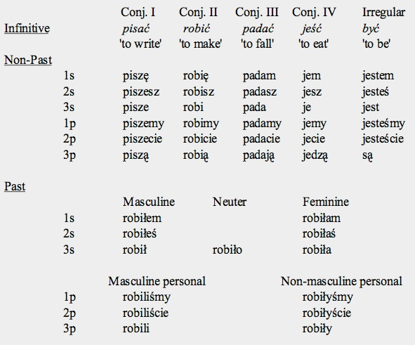

## Zawód (Profession)

> Kim jesteś (z zawodu)? = Who are you (by profession)?

### Recenzja (Review)

1. Jak on/ona ma na imię?
2. Jak on/ona się naszywa?
3. Kto to jest?

### Nowe Słowa

#### Zawody

- To jest aktor(ka) = Actor
- To jest piosenkarz/piosenkarka. = Singer
- To jest student(ka). = Student
- To jest nauczyciel(ka). = Teacher
- To jest fryzjer(ka). = Barber
- To jest klient(ka). = Client
- To jest policjant(ka). = Policeman / Policewoman
- To jest kelner(ka). = Waiter / Waitress
- To jest kasjer(ka). = Cashier
- To jest reporter(ka). = Reporter
- To jest dziennikarz/dziennikarka. = Reporter
- To jest pisarz/pisarka. = Writer
- To jest kucharz/kucharka. = Cook
- To jest lekarz/lekarka. = Doctor
- To jest dentysta/dentystka. = Dentist
- To jest pacjent(ka). = Patient
- To jest wykładowca/wykładowczyni. = Lecturer
- To jest fotograf(ka). = Photographer
- To jest kierowca/kierowczyni. = Driver
- To jest informatyk/informatyczka. = Computer scientist / IT specialist

#### Niektóre Formuły (Some Formulas)

To make a feminine profession,

- -rz => -rka
- -ca => -czyni

#### Inne Słowa (Other Words)

- Policja = Police (Institute)
- Informatyka = Computer science
- Fantazja = Imagination / Fantasy
- Kasa = Cash register
- Wykształcenie / Edukacja = Education
- Jaki jest jej numer telefonu? = What is her phone number?

### Nominativus vs. Instrumental

#### Przykład

- Nominativus

    - Kto to jest? = Who
    - Co to jest? = What (objekt)

- Instrumental

    - Kim ona jest? Ona jest lekarką.
    - Kim on jest? On jest lekarzem.

> "Kim on/ona jest?" to bardzo popularne pytanie.

#### Stosowanie (Usage)

- Femininum = Nie komplikowany

    - **a/i => ą**, n.p. dziennikarka => dziennikark**ą**

- Maskulinum

    - Generalnie dodać **-em**
        - n.p. student => student**em**
    - Przypadki specjalne (Special cases)
        - Dodać **-iem** przed **-k** albo **-g**
            - n.p. informaty**k** => informaty**kiem**
        - Czasowniki nieregularne (Irregular verbs) = Identycznie jak femininum
            - n.p. dentyst**a** => dentyst**ą**

#### Zadanie (Task)

1. On jest **lekarzem** i pracuje w szpitalu.
2. Ona jest **nauczycielką** i pracuje w szkole.
3. On jest **policjantem** i pracuje na komisariacie.
4. Ona jest **fryzjerką** i pracuje w salonie.
5. On jest **dentystą** i pracuje w gabinecie.
6. Ona jest **sekretarką** i pracuje w biurze.

### Koniugacja Czasownika (Verb Conjugation)

> Koniugacja numer/gruppa 1: -ować

#### Formula

Na przykład: pracować (to work)

> Basic formula: -ować -> -uj

1. Singular

    - (ja) prac**uję**
    - (ty) prac**ujesz**
    - on/ona/ono prac**uje**

2. Plural

    - my prac**ujemy**
    - wy prac**ujecie**
    - oni/panowie/one/panie/państwo prac**ują**

#### Table

| **Zaimek (Pronoun)**          | **Finał** |
|-------------------------------|-----------|
| (Ja)                          | -uję      |
| (Ty)                          | -ujesz    |
| On/Pan/Ona/Pani/Ono           | -uje      |
| (My)                          | -ujemy    |
| (Wy)                          | -ujecie   |
| Oni/Panowie/One/Panie/Państwo | -ują      |

### Bonus: Koniugacja Czasownika

